# PRAKTIKUM JARKOM MODUL 2 KELOMPOK 4 - 2026

## Anggota

| Nama | NRP |
| :---: | :---: |
| Albert Chen | 5027251034 |
| Boma Sahya Aryaguna | 5027251125 |

## Laporan

1. Sebagai pusat kesadaran The Mesh, `rootkit` bertindak sebagai router utama yang merentangkan koneksinya ke lima gerbang utama (Switch) yang berbeda. Pada tahap awal ini, kami merancang skema pengalamatan IP menggunakan blok privat kelas C dengan mengalokasikan subnet `/24` yang unik untuk setiap segmen jaringan, memastikan seluruh entitas dapat terhubung secara terstruktur melalui default gateway yang tepat.

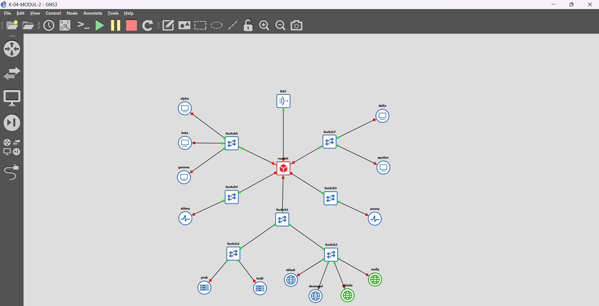

**Konfigurasi Jaringan**

Berikut adalah detail konfigurasi alamat IP dan gateway yang diterapkan pada setiap node menggunakan file `/etc/network/interfaces`:

**rootkit**  
```bash
auto eth0
iface eth0 inet dhcp

auto eth1
iface eth1 inet static
	address 192.213.1.1
	netmask 255.255.255.0

auto eth2
iface eth2 inet static
	address 192.213.2.1
	netmask 255.255.255.0

auto eth3
iface eth3 inet static
	address 192.213.3.1
	netmask 255.255.255.0

auto eth4
iface eth4 inet static
	address 192.213.4.1
	netmask 255.255.255.0

auto eth5
iface eth5 inet static
	address 192.213.5.1
	netmask 255.255.255.0
```

**prab**
```bash
auto eth0
iface eth0 inet static
	address 192.213.1.2
	netmask 255.255.255.0
	gateway 192.213.1.1
```

**tedd**
```bash
auto eth0
iface eth0 inet static
	address 192.213.1.3
	netmask 255.255.255.0
	gateway 192.213.1.1
```

**obladi**
```bash
auto eth0
iface eth0 inet static
	address 192.213.1.4
	netmask 255.255.255.0
	gateway 192.213.1.1
```

**desmond**
```bash
auto eth0
iface eth0 inet static
	address 192.213.1.5
	netmask 255.255.255.0
	gateway 192.213.1.1
```

**oblada**
```bash
auto eth0
iface eth0 inet static
	address 192.213.1.6
	netmask 255.255.255.0
	gateway 192.213.1.1
```

**molly**
```bash
auto eth0
iface eth0 inet static
	address 192.213.1.7
	netmask 255.255.255.0
	gateway 192.213.1.1
```

**alpha**
```bash
auto eth0
iface eth0 inet static
	address 192.213.2.2
	netmask 255.255.255.0
	gateway 192.213.2.1
```

**beta**
```bash
auto eth0
iface eth0 inet static
	address 192.213.2.3
	netmask 255.255.255.0
	gateway 192.213.2.1
```

**gamma**
```bash
auto eth0
iface eth0 inet static
	address 192.213.2.4
	netmask 255.255.255.0
	gateway 192.213.2.1
```

**delta**
```bash
auto eth0
iface eth0 inet static
	address 192.213.3.2
	netmask 255.255.255.0
	gateway 192.213.3.1
```

**epsilon**
```bash
auto eth0
iface eth0 inet static
	address 192.213.3.3
	netmask 255.255.255.0
	gateway 192.213.3.1
```

**abbey**
```bash
auto eth0
iface eth0 inet static
	address 192.213.4.2
	netmask 255.255.255.0
	gateway 192.213.4.1
```

**penny**
```bash
auto eth0
iface eth0 inet static
	address 192.213.5.2
	netmask 255.255.255.0
	gateway 192.213.5.1
```

**Validasi**  
Untuk membuktikan bahwa konfigurasi dasar ini telah terpasang dengan benar, dilakukan pengujian konektivitas dasar dari masing-masing node menuju ke default gateway-nya.

**Cara Validasi:** Menggunakan perintah `ping` dari host ke alamat IP gateway masing-masing segmen. Sebagai contoh, dari node `alpha` (`192.213.2.2`), dilakukan pengecekan ke gateway:
```bash
ping 192.213.2.1
```

**Hasil yang diharapkan:** Mendapatkan balasan (reply) secara konsisten dari router `rootkit`. Hal ini mengonfirmasi bahwa:
- Konfigurasi alamat IP dan netmask pada setiap node sudah valid.
- Konektivitas fisik maupun Layer 2 melalui switch menuju router `rootkit` berfungsi dengan sempurna.
- Konfigurasi interface pada router pusat (`rootkit`) telah aktif dan siap meneruskan paket data antar-segmen.


2. Meskipun The Mesh beroperasi dalam bayang-bayang, `rootkit` menyadari bahwa seluruh Entitas di dalamnya masih membutuhkan akses komunikasi menuju dunia luar. Oleh karena itu, pada tahap ini dilakukan konfigurasi Network Address Translation (NAT) pada router pusat `rootkit` agar seluruh host di jaringan internal dapat menjangkau internet publik.

Dengan mengaktifkan NAT, `rootkit` akan menerjemahkan (masquerade) alamat IP privat dari setiap node internal menjadi alamat IP publik miliknya pada interface WAN (`eth0`) saat keluar menuju internet. Hal ini memungkinkan berbagai segmen jaringan internal berbagi satu jalur koneksi luar secara bersamaan.

**Konfigurasi di Rootkit**

Langkah pertama dilakukan langsung pada router pusat `rootkit`. Kami menginstal utilitas `iptables` (jika belum tersedia) dan menambahkan aturan masquerade untuk seluruh subnet internal `192.213.0.0/16` yang keluar melalui interface `eth0`
```bash
apt update
apt install iptables -y
iptables -t nat -A POSTROUTING -o eth0 -j MASQUERADE -s 192.213.0.0/16
```

**Validasi**
Untuk membuktikan bahwa konfigurasi NAT berhasil dan lalu lintas internet dapat dijangkau dari dalam jaringan, dilakukan pengujian konektivitas dari salah satu node internal (misalnya `prab`).

**Cara Validasi:** Menggunakan perintah `ping` langsung ke alamat IP publik eksternal (menggunakan DNS Publik Google di `8.8.8.8`) guna memastikan konektivitas murni tanpa kendala resolusi DNS:
```bash
ping 8.8.8.8
```

**Hasil yang diharapkan:** Node prab (dengan IP privat `192.213.1.2`) berhasil menerima balasan (reply) dari `8.8.8.8`. Hal ini mengonfirmasi bahwa:
- Paket dari node internal berhasil diteruskan oleh `rootkit`  .
- `rootkit` sukses melakukan masquerade IP sumber privat menjadi IP publik pada interface WAN (`eth0`).
- Lalu lintas data dari internet berhasil kembali dan diterjemahkan ulang oleh `rootkit` menuju node internal yang meminta.

3. Jaringan rahasia tidak akan berfungsi tanpa sinkronisasi antar divisi. Pada tahap ini, dipastikan seluruh Entitas dapat saling terhubung dan berkomunikasi lintas jalur melalui router pusat `rootkit`. Selain itu, untuk menghindari kendala saat instalasi paket, setiap host non-router dikonfigurasi dengan resolver DNS lokal agar akses unduh dari internet dapat langsung tersedia sejak awal.

**Konfigurasi**

1. Routing Internal: Konektivitas antar-subnet (lintas jalur antar-segmen jaringan yang terhubung ke `rootkit`) secara implisit telah aktif berkat fungsionalitas IP forwarding pada router pusat `rootkit`. Hal ini memungkinkan `rootkit` untuk meneruskan paket data dari satu segmen jaringan ke segmen lainnya dengan mulus.
2. Resolver DNS Awal: Agar setiap host non-router dapat melakukan resolusi nama domain guna mengunduh paket instalasi dari internet, ditambahkan nameserver `192.168.122.1` ke dalam file `/etc/resolv.conf` pada masing-masing host:
```bash
echo "nameserver 192.168.122.1" > /etc/resolv.conf
```

**Validasi**

Untuk memastikan bahwa routing lintas segmen dan akses internet via DNS berjalan dengan baik, dilakukan dua jenis pengujian dari node `prab`:

1. Validasi Routing Internal: Pengujian dilakukan untuk membuktikan bahwa `rootkit` berhasil merutekan trafik lintas jalur (dari segmen `192.213.1.0/24` menuju segmen operator di `192.213.2.0/24`):
```bash
ping 192.213.2.2
```
Hasil yang diharapkan: Mendapat balasan (reply) secara konsisten, menandakan router pusat `rootkit` berfungsi sempurna sebagai penghubung antar-sub jaringan.

2. Validasi Resolver DNS dan Akses Internet: Pengujian dilakukan untuk memastikan kemampuan resolusi domain dan konektivitas keluar:
```bash
ping google.com
```
Hasil yang diharapkan: Domain `google.com` berhasil di-resolve ke alamat IP publik dan mendapatkan balasan ping, membuktikan bahwa konfigurasi resolver `/etc/resolv.conf` telah aktif dan jalur internet siap digunakan untuk kebutuhan instalasi paket.

4. Penjaga Direktori mulai menuliskan hukum The Mesh dengan membangun sistem DNS internal yang andal. Pada tahap ini, node `prab` dikonfigurasi sebagai server DNS master (utama) dan node `tedd` sebagai server DNS slave (cadangan) untuk domain `k04.com`. Implementasi ini bertujuan untuk memastikan redundansi data domain, sehingga jika server utama mengalami kendala, server cadangan dapat mengambil alih layanan resolusi nama secara mulus.

**Konfigurasi di Prab (DNS Master)**

Langkah pertama dilakukan pada node `prab` (`192.213.1.2`) dengan menginstal paket `BIND9`, mengatur direktori zona, serta mendefinisikan record untuk domain `k04.com`.

- Instalasi dan Konfigurasi Opsi: Mengatur BIND9 agar meneruskan (forward) query yang tidak dikenal ke DNS publik `192.168.122.1`
```bash
apt update
apt install bind9 -y
ln -s /etc/init.d/named /etc/init.d/bind9
```

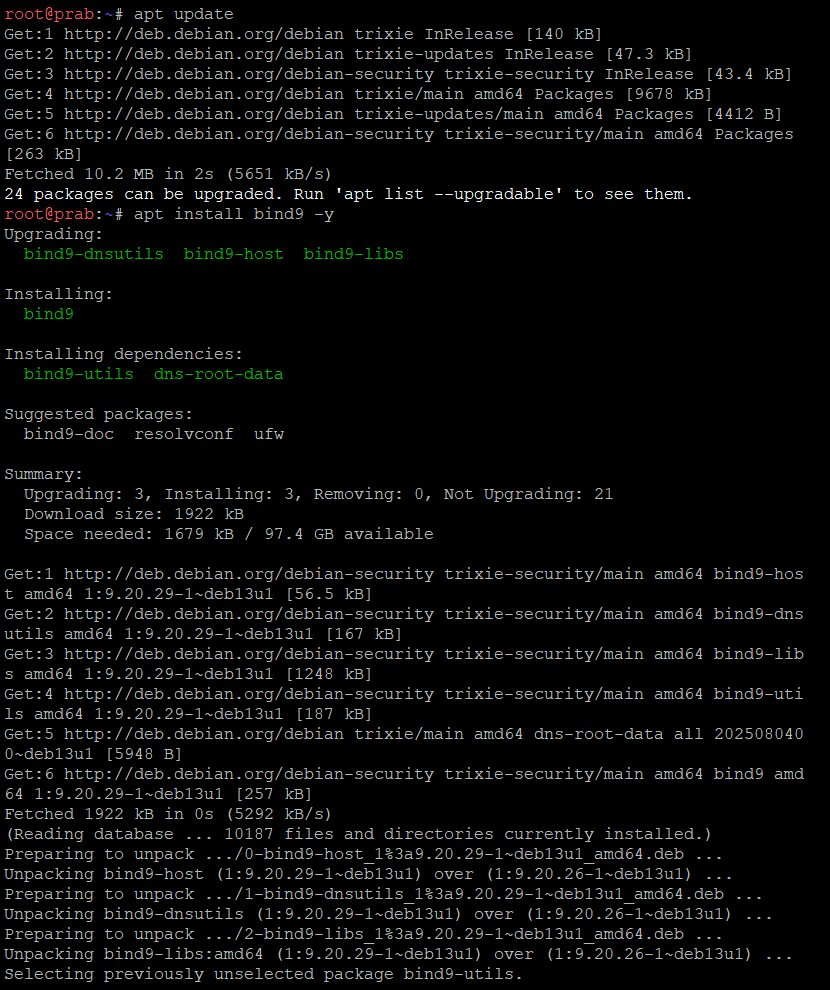

```bash
options {
    directory "/var/cache/bind";
    forwarders {
        192.168.122.1;
    };
    allow-query { any; };
    auth-nxdomain no;
    listen-on { any; };
    listen-on-v6 { any; };
};
```

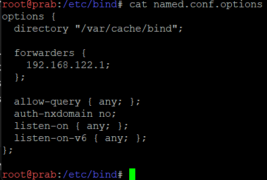

- Pembuatan File Zona: Membuat catatan SOA, NS, serta A record untuk menghubungkan hostname ke IP masing-masing dan domain apex ke gerbang aplikasi dinamis (`penny` di `192.213.5.2`)
```bash
$TTL    604800          ; Waktu cache default (detik)
@       IN      SOA     prab.k04.com. root.k04.com. (
                        2026092801 ; Serial (format YYYYMMDDXX)
                        604800     ; Refresh (1 minggu)
                        86400      ; Retry (1 hari)
                        2419200    ; Expire (4 minggu)
                        604800 )   ; Negative Cache TTL

@       IN      NS      prab.k04.com.
@       IN      NS      tedd.k04.com.

prab    IN      A       192.213.1.2
tedd    IN      A       192.213.1.3

@       IN      A       192.213.5.2
```

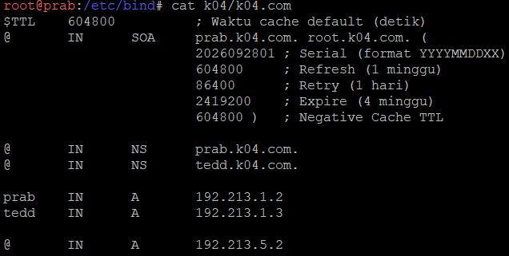

- Pendaftaran Zona Master: Mendaftarkan zona `k04.com` dan memberikan izin transfer data ke node `tedd` (`192.213.1.3`) serta mengaktifkan notifikasi pembaruan:
```bash
zone "k04.com" {
    type master;
    file "/etc/bind/k04/k04.com";
    allow-transfer { 192.213.1.3; };
    notify yes;
};
```

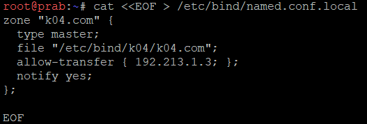

Lalu jalankan ulang layanan BIND9:
```bash
service bind9 restart
```

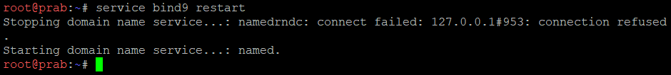

Konfigurasi di Semua Klien
```bash
echo "nameserver 192.213.1.2" > /etc/resolv.conf
echo "nameserver 192.213.1.3" >> /etc/resolv.conf
echo "nameserver 192.168.122.1" >> /etc/resolv.conf
```
```bash
dig @localhost k04.com
```
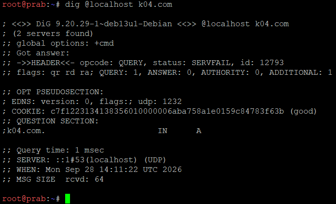

**Konfigurasi di Tedd (DNS Slave)**

Di node `tedd` (`192.213.1.3`), BIND9 dikonfigurasi sebagai slave yang akan menarik data zona secara otomatis dari master (`prab`).

Pendaftaran Zona Slave
```bash
apt update
apt install bind9 -y
ln -s /etc/init.d/named /etc/init.d/bind9
```
```
zone "k04.com" {
    type slave;
    masters { 192.213.1.2; };
    file "/var/lib/bind/k04/k04.com";
};
```
Menyiapkan direktori penyimpanan cache dan merestart layanan:
```bash
mkdir -p /var/lib/bind/k04 && chown bind:bind /var/lib/bind/k04
service bind9 restart
```

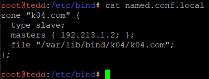

```bash
service bind9 restart
```

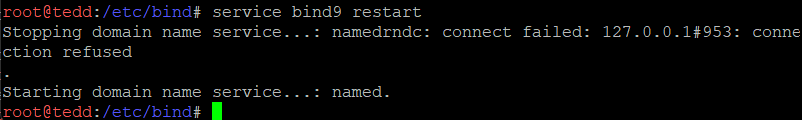

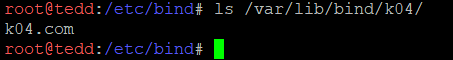

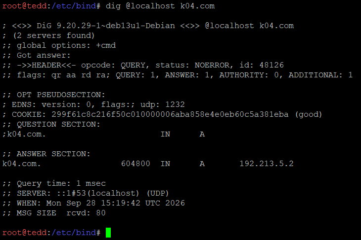

Agar seluruh entitas non-router memprioritaskan server DNS internal sebelum melempar ke DNS luar, urutan resolver pada file `/etc/resolv.conf` di setiap host diperbarui menjadi:
```bash
echo "nameserver 192.213.1.2" > /etc/resolv.conf
echo "nameserver 192.213.1.3" >> /etc/resolv.conf
echo "nameserver 192.168.122.1" >> /etc/resolv.conf
```

**Validasi**

Untuk membuktikan bahwa sistem DNS master-slave berjalan dengan benar, dilakukan pengujian query dari node klien (misalnya `alpha`) menggunakan perintah `dig`:

Cara Validasi:
```bash
dig k04.com
```

Hasil yang diharapkan:
- Perintah `dig` mengembalikan respons pada Answer Section yang menunjukkan bahwa domain `k04.com` berhasil diterjemahkan ke alamat IP gerbang aplikasi dinamis `penny` (`192.213.5.2`).
- Server DNS yang melayani permintaan (`SERVER: 192.213.1.2#53` atau `192.213.1.3#53`) merespons secara authoritative, mengonfirmasi bahwa sinkronisasi antara master (`prab`) dan slave (`tedd`) telah berhasil dilakukan.

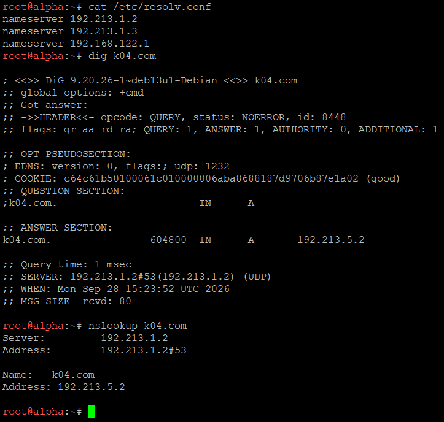

5. "Entitas tanpa identitas adalah anomali," pesan Rootkit. Agar setiap entitas di dalam jaringan dapat dikenali dan dihubungi melalui nama yang terstruktur, tahap ini berfokus pada penambahan A record untuk seluruh node non-router (`alpha`, `beta`, `gamma`, `delta`, `epsilon`, `abbey`, `penny`, `obladi`, `desmond`, `oblada`, dan `molly`) ke dalam server DNS master (`prab`). Sesuai aturan, pengecualian diberikan kepada node yang bertanggung jawab langsung atas layanan DNS (`prab` dan `tedd`) karena record mereka telah didefinisikan sebelumnya pada tahap awal pembuatan zona.

**Penambahan A Record pada Server Master (Prab)**

Semua pemetaan nama host ke alamat IP statis masing-masing ditambahkan ke dalam file zona DNS utama milik domain `k04.com`
```bash
cat <<EOF >> /etc/bind/k04/k04.com
alpha       IN      A       192.213.2.2
beta        IN      A       192.213.2.3
gamma       IN      A       192.213.2.4
delta       IN      A       192.213.3.2
epsilon     IN      A       192.213.3.3
abbey       IN      A       192.213.4.2
penny       IN      A       192.213.5.2
obladi      IN      A       192.213.1.4
desmond     IN      A       192.213.1.5
oblada      IN      A       192.213.1.6
molly       IN      A       192.213.1.7

EOF
```

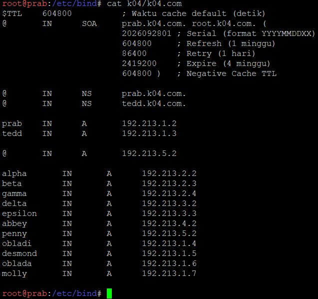

```bash
service bind9 restart
```

**Validasi**

Untuk membuktikan bahwa seluruh subdomain baru tersebut dapat dikenali secara system-wide dan berfungsi dengan benar di lintas segmen jaringan, dilakukan pengujian konektivitas menggunakan perintah `ping` dari salah satu klien (misalnya `alpha`):

Cara Validasi: Menguji resolusi nama dan konektivitas ke beberapa node dari segmen yang berbeda:
```bash
ping beta.k04.com
ping obladi.k04.com
ping epsilon.k04.com
```

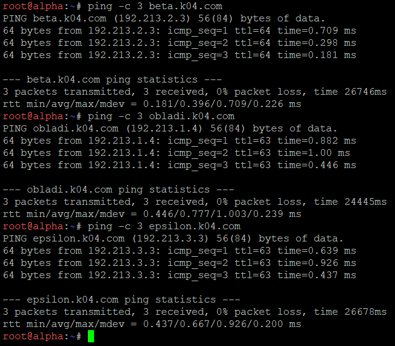

Hasil yang Diharapkan:

- Resolusi Nama Berhasil: Nama domain lengkap (seperti `beta.k04.com`, `obladi.k04.com`, dan `epsilon.k04.com`) berhasil diterjemahkan oleh server DNS master/slave ke alamat IP masing-masing secara akurat.

- Konektivitas Terjalin: Perintah `ping` menerima balasan (reply) dari host tujuan. Keberhasilan ini memvalidasi bahwa seluruh A record subdomain telah terdaftar dengan benar dan routing lintas segmen berfungsi secara utuh di seluruh jaringan The Mesh.

6. Sinkronisasi antara pusat direktori utama dan cadangan merupakan hal mutlak; `tedd` telah menerima salinan zona terbaru dari `prab`. Nilai serial SOA di kedua server DNS tersebut dipastikan sama persis karena keduanya saling melengkapi dalam menjaga ketersediaan layanan nama domain.

Zone transfer adalah mekanisme replikasi data zona dari server DNS master (`prab`) ke server slave (`tedd`). Keberhasilan proses ini dikontrol oleh nomor seri SOA (Start of Authority). Ketika server master mengalami pembaruan data, nomor seri SOA harus dinaikkan agar server slave mendeteksi perubahan dan melakukan penyalinan data secara otomatis maupun melalui notifikasi langsung (notify).

**Validasi**

Untuk membuktikan bahwa mekanisme zone transfer berjalan dengan sukses dan kedua server memiliki salinan data yang identik, dilakukan pengujian query DNS menggunakan utilitas `dig` dari sisi klien (`alpha`):

Cara Validasi: Melakukan query tipe SOA secara spesifik ke server master (`prab` di `192.213.1.2`) dan server slave (`tedd` di `192.213.1.3`) menggunakan parameter `+short` untuk menampilkan output ringkas
```bash
dig @192.213.1.2 k04.com SOA +short
dig @192.213.1.3 k04.com SOA +short
```

Hasil yang Diharapkan: Output nilai serial SOA (misalnya `2026092801`) yang dikembalikan oleh kedua perintah tersebut harus identik dan sama persis. Kesamaan nilai ini mengonfirmasikan bahwa:
- Mekanisme zone transfer dari master (`prab`) ke slave (`tedd`) berhasil dilakukan dengan sempurna.
- Redundansi dan konsistensi data pada sistem DNS master-slave The Mesh terjaga tanpa adanya perbedaan informasi.

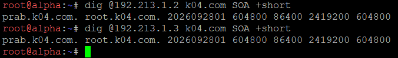

7. Dalam arsitektur jaringan The Mesh, `abbey` dan `penny` berperan sebagai gerbang utama, `obladi` dan `desmond` mengelola area web statis (Vault), serta `oblada` dan `molly` mengelola area web dinamis (Core). Untuk memudahkan akses layanan menggunakan nama panggilan yang umum, dilakukan penambahan A record bagi klaster layanan serta CNAME record (Canonical Name) untuk menghubungkan domain umum ke hostname spesifik masing-masing entitas.

Semua perubahan konfigurasi DNS dilakukan pada server master (`prab`). Kami menambahkan A record untuk `vault` dan `core` (yang masing-masing mengarah ke dua alamat IP menggunakan teknik Round-Robin DNS), serta menetapkan CNAME record untuk `www` dan `static`
```bash
cat <<EOF >> /etc/bind/k04/k04.com
vault       IN      A       192.213.1.4
vault       IN      A       192.213.1.5
core        IN      A       192.213.1.6
core        IN      A       192.213.1.7

www         IN      CNAME   penny.k04.com.
static      IN      CNAME   abbey.k04.com.

EOF
```

Setelah file disimpan, layanan BIND9 dimuat ulang agar perubahan diterapkan

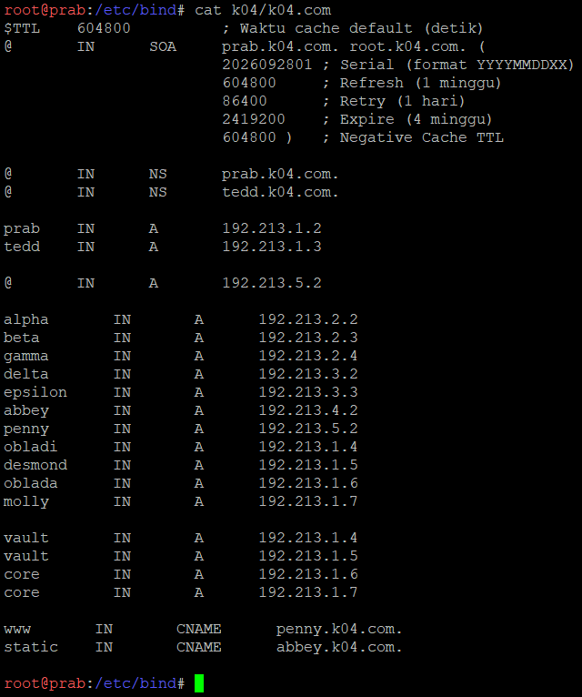

```bash
service bind9 restart
```

**Validasi**

Untuk membuktikan bahwa pemetaan A record klaster dan CNAME record berfungsi dengan benar serta terpropagasi secara konsisten, dilakukan verifikasi dari dua klien berbeda (yaitu `alpha` dan `delta`) menggunakan utilitas `dig`

1. Pengujian dari klien `alpha`
```bash
dig www.k04.com +short
dig static.k04.com +short
dig vault.k04.com +short
dig core.k04.com +short
```

2. Pengujian dari klien `delta`
```bash
dig www.k04.com +short
dig static.k04.com +short
dig vault.k04.com +short
dig core.k04.com +short
```

**Hasil yang Diharapkan:** 
- Query untuk `[www.k04.com](https://www.k04.com)` dan `static.k04.com` berhasil mengembalikan target canonical name atau alamat IP tujuan secara tepat.

- Query untuk klaster `vault.k04.com` dan `core.k04.com` secara konsisten mengembalikan daftar alamat IP dari node-node di bawahnya (`192.213.1.4` dan `192.213.1.5` untuk Vault, serta `192.213.1.6` dan `192.213.1.7` untuk Core).

- Hasil pengujian dari kedua klien (`alpha` dan `delta`) menunjukkan respons yang identik dan konsisten, memvalidasi bahwa seluruh record DNS telah berhasil disebarkan ke seluruh jaringan The Mesh.

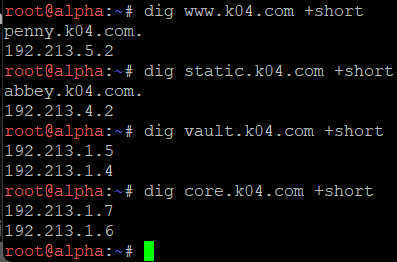

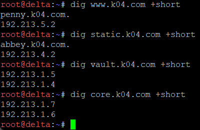

8. Untuk memastikan bahwa setiap alamat IP pada node-node utama (meliputi abbey, penny, area vault / obladi & desmond, serta area core / oblada & molly) dapat melacak balik ke nama host yang bersesuaian secara akurat dan authoritative, dilakukan konfigurasi Reverse DNS (PTR Record) pada server master (`prab` / `ns1`) serta sinkronisasi slave pada server `tedd` (`ns2`).

**Konfigurasi di Prab (DNS Master)**

Pertama, kami mendeklarasikan reverse zone untuk segmen-segmen jaringan tempat node-node tersebut berada di dalam file `/etc/bind/named.conf.local`, lengkap dengan aturan allow-transfer ke server slave (`tedd` di `192.213.1.3`)
```bash
cat <<EOF >> /etc/bind/named.conf.local

zone "1.213.192.in-addr.arpa" {
    type master;
    file "/etc/bind/k04/1.213.192.in-addr.arpa";
    allow-transfer { 192.213.1.3; };
};

zone "4.213.192.in-addr.arpa" {
    type master;
    file "/etc/bind/k04/4.213.192.in-addr.arpa";
    allow-transfer { 192.213.1.3; };
};

zone "5.213.192.in-addr.arpa" {
    type master;
    file "/etc/bind/k04/5.213.192.in-addr.arpa";
    allow-transfer { 192.213.1.3; };
};
EOF
```

Selanjutnya, kami membuat dan mengisi masing-masing file zone dengan record PTR untuk memetakan alamat IP ke hostname yang benar (`abbey`, `penny`, vault, core, serta server DNS itu sendiri)

**File Zona Segmen 1**
```bash
cat <<EOF > /etc/bind/k04/1.213.192.in-addr.arpa
\$TTL    604800
@       IN      SOA     prab.k04.com. root.k04.com. (
                        2026092801 ; Serial
                        604800     ; Refresh
                        86400      ; Retry
                        2419200    ; Expire
                        604800 )   ; Negative Cache TTL

@       IN      NS      prab.k04.com.
@       IN      NS      tedd.k04.com.

2       IN      PTR     prab.k04.com.
3       IN      PTR     tedd.k04.com.
4       IN      PTR     obladi.k04.com.
5       IN      PTR     desmond.k04.com.
6       IN      PTR     oblada.k04.com.
7       IN      PTR     molly.k04.com.
EOF
```

**File Zona Segmen 4**
```bash
cat <<EOF > /etc/bind/k04/4.213.192.in-addr.arpa
\$TTL    604800
@       IN      SOA     prab.k04.com. root.k04.com. (
                        2026092801 ; Serial
                        604800     ; Refresh
                        86400      ; Retry
                        2419200    ; Expire
                        604800 )   ; Negative Cache TTL

@       IN      NS      prab.k04.com.
@       IN      NS      tedd.k04.com.

2       IN      PTR     abbey.k04.com.
EOF
```

**File Zona Segmen 5**
```bash
cat <<EOF > /etc/bind/k04/5.213.192.in-addr.arpa
\$TTL    604800
@       IN      SOA     prab.k04.com. root.k04.com. (
                        2026092801 ; Serial
                        604800     ; Refresh
                        86400      ; Retry
                        2419200    ; Expire
                        604800 )   ; Negative Cache TTL

@       IN      NS      prab.k04.com.
@       IN      NS      tedd.k04.com.

2       IN      PTR     penny.k04.com.
EOF
```

Setelah konfigurasi selesai, layanan BIND9 direstart untuk menerapkan perubahan:
```bash
service bind9 restart
```

**Konfigurasi di Tedd (DNS Slave)**

Di server slave `tedd`, kami mendaftarkan ketiga reverse zone tersebut dengan tipe `slave` dan mengarahkannya ke server master (`192.213.1.2`) agar melakukan zone transfer secara otomatis:
```bash
cat <<EOF >> /etc/bind/named.conf.local

zone "1.213.192.in-addr.arpa" {
    type slave;
    masters { 192.213.1.2; };
    file "/var/lib/bind/k04/1.213.192.in-addr.arpa";
};

zone "4.213.192.in-addr.arpa" {
    type slave;
    masters { 192.213.1.2; };
    file "/var/lib/bind/k04/4.213.192.in-addr.arpa";
};

zone "5.213.192.in-addr.arpa" {
    type slave;
    masters { 192.213.1.2; };
    file "/var/lib/bind/k04/5.213.192.in-addr.arpa";
};
EOF
```

Layanan BIND9 di `tedd` kemudian direstart:
```bash
service bind9 restart
```

**Verifikasi**

Pengujian reverse lookup dilakukan dari node klien (`alpha`) untuk memastikan bahwa pencarian balik alamat IP mengembalikan hostname yang benar dan dijawab secara authoritative
```bash
host -t ptr 192.213.4.2
host -t ptr 192.213.5.2
host -t ptr 192.213.1.4
host -t ptr 192.213.1.6
```

Hasil yang Diharapkan:

Setiap perintah reverse lookup di atas berhasil memetakan alamat IP tujuan kembali ke hostname aslinya masing-masing (`abbey.k04.com`, `penny.k04.com`, `obladi.k04.com`, dan `oblada.k04.com`), membuktikan bahwa konfigurasi Reverse DNS dan replikasi zone transfer berjalan dengan sukses dan konsisten di seluruh jaringan.

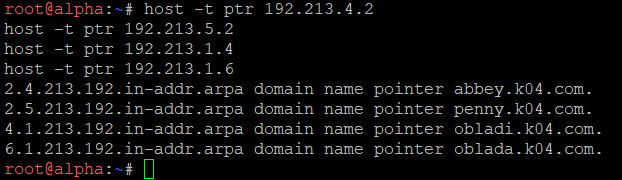

9. Pada area vault dari arsitektur jaringan The Mesh, node `obladi` dan `desmond` ditugaskan untuk menjalankan layanan web statis menggunakan Apache HTTP Server. Selain itu, direktori `/arsip/` dikonfigurasi dengan fitur autoindex (directory listing) aktif agar seluruh daftar file di dalamnya dapat ditelusuri langsung melalui browser atau perintah klien menggunakan hostname masing-masing.

**Konfigurasi di Obladi (Web Statis)**

Langkah pertama adalah melakukan instalasi Apache2 pada node `obladi`, membuat direktori penyimpanan arsip, serta mengatur konfigurasi Virtual Host agar mengarah ke direktori tersebut dengan fitur indexes diaktifkan:
```bash
apt update
apt install apache2 -y

mkdir -p /var/www/arsip/

cat <<EOF > /etc/apache2/sites-available/000-default.conf
<VirtualHost *:80>
    ServerName obladi.k04.com
    ServerAdmin webmaster@obladi.k04.com
    DocumentRoot /var/www/arsip

    <Directory /var/www/arsip>
        Options +Indexes
        AllowOverride None
        Require all granted
    </Directory>

    ErrorLog /var/log/apache2/error.log
    CustomLog /var/log/apache2/access.log combined
</VirtualHost>
EOF

service apache2 restart
```

**Konfigurasi di Desmond (Web Statis)**

Langkah serupa juga diterapkan pada node `desmond` untuk memastikan layanan web statis berjalan secara konsisten di area vault
```bash
apt update
apt install apache2 -y

mkdir -p /var/www/arsip/

cat <<EOF > /etc/apache2/sites-available/000-default.conf
<VirtualHost *:80>
    ServerName desmond.k04.com
    ServerAdmin webmaster@desmond.k04.com
    DocumentRoot /var/www/arsip

    <Directory /var/www/arsip>
        Options +Indexes
        AllowOverride None
        Require all granted
    </Directory>

    ErrorLog /var/log/apache2/error.log
    CustomLog /var/log/apache2/access.log combined
</VirtualHost>
EOF

service apache2 restart
```

**Validasi**

Untuk membuktikan bahwa layanan web statis dan fitur autoindex berjalan dengan benar, pengujian dilakukan dari mesin klien (`alpha`) dengan mengakses langsung melalui hostname (bukan alamat IP):
```bash
curl http://obladi.k04.com
curl http://desmond.k04.com
```

Hasil yang Diharapkan: Perintah `curl` berhasil mengembalikan output berupa kode HTML yang secara otomatis dihasilkan oleh Apache (`Index of /`), menandakan bahwa fitur autoindex aktif dan direktori `/arsip/` berhasil disajikan serta ditelusuri melalui hostname masing-masing node vault.

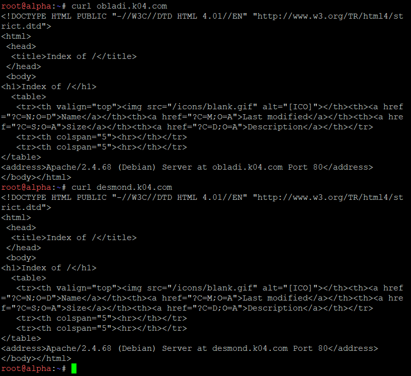

10. Pada area core dari arsitektur jaringan The Mesh, node `oblada` dan `molly` ditugaskan untuk menjalankan layanan web dinamis menggunakan Nginx dan PHP-FPM. Selain itu, diterapkan aturan URL rewrite pada server agar halaman seperti `/profil` dapat diakses secara bersih tanpa menggunakan akhiran `.php`, dengan pengujian wajib dilakukan melalui hostname masing-masing.

**Konfigurasi di Oblada (Web Dinamis)**

Langkah pertama adalah memperbarui repositori dan menginstal Nginx serta PHP-FPM pada node `oblada`. Selanjutnya, dibuat direktori web root `/var/www/html` beserta file aplikasi sederhana (`index.php` dan `profil.php`)
```bash
apt update
apt install nginx php-fpm -y

mkdir -p /var/www/html

cat <<EOF > /var/www/html/index.php
<?php
echo "<h1>Selamat Datang di Beranda Core (Oblada)</h1>";
echo "<p>Ini adalah halaman utama web dinamis.</p>";
?>
EOF

cat <<EOF > /var/www/html/profil.php
<?php
echo "<h1>Halaman Profil Oblada</h1>";
echo "<p>Ini adalah halaman profil resmi dari area core (oblada).</p>";
?>
EOF
```

Kemudian, konfigurasi Virtual Host Nginx disesuaikan untuk mendefinisikan server_name, mengaktifkan aturan rewrite untuk URL bersih, serta menangani eksekusi file PHP menggunakan Unix Socket PHP-FPM
```bash
cat <<EOF > /etc/nginx/sites-available/default
server {
    listen 80 default_server;
    listen [::]:80 default_server;

    root /var/www/html;
    index index.php index.html index.htm;

    server_name oblada.k04.com core.k04.com;

    # Aturan URL Rewrite agar /profil bisa diakses tanpa .php
    location / {
        try_files \$uri \$uri/ @rewrite;
    }

    location @rewrite {
        rewrite ^/(.*)\$ /\$1.php last;
    }

    # Penanganan file PHP menggunakan PHP-FPM Unix Socket
    location ~ \.php\$ {
        include snippets/fastcgi-php.conf;
        fastcgi_pass unix:/var/run/php/php8.4-fpm.sock;
    }

    location ~ /\.ht {
        deny all;
    }
}
EOF

service php8.4-fpm restart
service nginx restart
```

**Konfigurasi di Molly (Web Dinamis)**

Langkah serupa juga diterapkan pada node `molly` untuk memastikan layanan web dinamis berjalan secara konsisten di area core
```bash
apt update
apt install nginx php-fpm -y

mkdir -p /var/www/html

cat <<EOF > /var/www/html/index.php
<?php
echo "<h1>Selamat Datang di Beranda Core (Molly)</h1>";
echo "<p>Ini adalah halaman utama web dinamis.</p>";
?>
EOF

cat <<EOF > /var/www/html/profil.php
<?php
echo "<h1>Halaman Profil Molly</h1>";
echo "<p>Ini adalah halaman profil resmi dari area core (molly).</p>";
?>
EOF

cat <<EOF > /etc/nginx/sites-available/default
server {
    listen 80 default_server;
    listen [::]:80 default_server;

    root /var/www/html;
    index index.php index.html index.htm;

    server_name molly.k04.com core.k04.com;

    # Aturan URL Rewrite agar /profil bisa diakses tanpa .php
    location / {
        try_files \$uri \$uri/ @rewrite;
    }

    location @rewrite {
        rewrite ^/(.*)\$ /\$1.php last;
    }

    # Penanganan file PHP menggunakan PHP-FPM Unix Socket
    location ~ \.php\$ {
        include snippets/fastcgi-php.conf;
        fastcgi_pass unix:/var/run/php/php8.4-fpm.sock;
    }

    location ~ /\.ht {
        deny all;
    }
}
EOF

service php8.4-fpm restart
service nginx restart
```

**Validasi**

Untuk membuktikan bahwa layanan web dinamis berbasis Nginx dan PHP-FPM serta aturan URL rewrite berfungsi dengan benar, pengujian dilakukan dari mesin klien (`alpha`) menggunakan perangkat baris perintah `curl` dengan mengakses langsung melalui hostname
```bash
# Menguji halaman utama (beranda)
curl http://oblada.k04.com/
curl http://molly.k04.com/

# Menguji halaman profil dengan URL bersih (tanpa akhiran .php)
curl http://oblada.k04.com/profil
curl http://molly.k04.com/profil
```

Hasil yang Diharapkan:
- Perintah `curl` ke halaman utama berhasil mengeksekusi skrip `index.php` dan mengembalikan teks sambutan beranda masing-masing node.

- Perintah `curl` ke `/profil` berhasil diterjemahkan oleh aturan rewrite Nginx ke file `profil.php` tanpa menampilkan ekstensi file, membuktikan bahwa arsitektur web dinamis area core berjalan dengan sukses dan responsif di seluruh jaringan The Mesh.

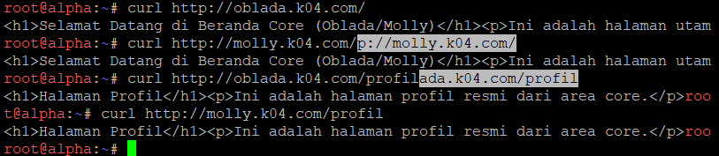


11. Agar area penyimpanan data The Mesh tidak diakses secara langsung oleh pengunjung, `rootkit` menempatkan dua gerbang penyaring sebagai perantara. Node `penny` (menggunakan Apache) bertugas sebagai reverse proxy menuju area vault (`obladi` dan `desmond`), sedangkan node `abbey` (menggunakan Nginx) bertugas sebagai reverse proxy menuju area core (`oblada` dan `molly`). Selain meneruskan permintaan, kedua gerbang ini juga membagi beban secara bergantian (load balancing) ke setiap backend dan meneruskan identitas asli pengunjung melalui header `Host` dan `X-Real-IP`.

Secara sederhana, alur lalu lintasnya adalah sebagai berikut:
```
alpha → www.k04.com    (penny) → obladi / desmond  (bergantian)
alpha → static.k04.com (abbey) → oblada / molly    (bergantian)
```

Penjelasan singkat istilah yang digunakan:
- **Reverse proxy**: server perantara yang menerima permintaan dari pengunjung, lalu meneruskannya ke server di belakangnya (backend).
- **Load balancing**: pembagian permintaan secara bergantian ke beberapa backend agar beban tidak menumpuk di satu server.
- **Header `Host`**: nama domain yang diakses oleh pengunjung (misalnya `www.k04.com`).
- **Header `X-Real-IP`**: alamat IP asli pengunjung. Header ini diperlukan karena backend hanya melihat IP milik gerbang (proxy), bukan IP pengunjung.

**Persiapan di Obladi dan Desmond (Backend Vault)**

Agar pembagian beban dapat dibuktikan, setiap node vault diberi file penanda `whoami.txt` yang berisi nama node tersebut. Selain itu, ditambahkan log khusus `header.log` untuk mencatat header `Host` dan `X-Real-IP` yang diterima dari `penny`:
```bash
echo "Dilayani oleh: $(hostname)" > /var/www/arsip/whoami.txt

cat <<EOF > /etc/apache2/sites-available/000-default.conf
<VirtualHost *:80>
    ServerName $(hostname).k04.com
    DocumentRoot /var/www/arsip

    <Directory /var/www/arsip>
        Options +Indexes
        AllowOverride None
        Require all granted
    </Directory>

    ErrorLog /var/log/apache2/error.log
    CustomLog /var/log/apache2/access.log combined
    CustomLog /var/log/apache2/header.log "%t dari=%h Host=%{Host}i X-Real-IP=%{X-Real-IP}i \"%r\""
</VirtualHost>
EOF

service apache2 restart
```

**Persiapan di Oblada dan Molly (Backend Core)**

Pada setiap node core dibuat halaman `headers.php` yang menampilkan nama backend beserta header yang diterimanya. Halaman ini dapat diakses melalui `/headers` berkat aturan rewrite dari soal 10:
```bash
cat <<'EOF' > /var/www/html/headers.php
<?php
echo "Backend      : " . gethostname() . "\n";
echo "Host header  : " . ($_SERVER['HTTP_HOST'] ?? '-') . "\n";
echo "X-Real-IP    : " . ($_SERVER['HTTP_X_REAL_IP'] ?? '-') . "\n";
echo "REMOTE_ADDR  : " . ($_SERVER['REMOTE_ADDR'] ?? '-') . "\n";
EOF
```

**Konfigurasi di Penny (Apache Reverse Proxy → Vault)**

Langkah pertama adalah menginstal Apache pada node `penny`, lalu mengaktifkan modul-modul yang dibutuhkan untuk reverse proxy dan load balancing:
```bash
apt update
apt install apache2 -y
a2enmod proxy proxy_http proxy_balancer lbmethod_byrequests headers
mkdir -p /etc/apache2/penny-extra
```

Kegunaan masing-masing modul:
- `proxy` dan `proxy_http`: mengaktifkan fitur reverse proxy ke backend HTTP.
- `proxy_balancer` dan `lbmethod_byrequests`: membagi permintaan secara bergantian ke beberapa backend.
- `headers`: memungkinkan penambahan header `X-Real-IP`.

Selanjutnya dibuat virtual host `www.k04.com` yang meneruskan permintaan ke `obladi` (`192.213.1.4`) dan `desmond` (`192.213.1.5`):
```bash
cat <<'EOF' > /etc/apache2/sites-available/www.conf
<VirtualHost *:80>
    ServerName www.k04.com

    # Meneruskan header Host asli dari pengunjung
    ProxyPreserveHost On
    # Meneruskan IP asli pengunjung melalui header X-Real-IP
    RequestHeader set X-Real-IP "expr=%{REMOTE_ADDR}"

    # Daftar backend area vault
    <Proxy "balancer://vault">
        BalancerMember "http://192.213.1.4"
        BalancerMember "http://192.213.1.5"
    </Proxy>

    # Tempat konfigurasi tambahan untuk soal berikutnya (/admin dan /eternal)
    IncludeOptional /etc/apache2/penny-extra/*.conf

    ProxyPass        "/" "balancer://vault/"
    ProxyPassReverse "/" "balancer://vault/"

    ErrorLog  ${APACHE_LOG_DIR}/www_error.log
    CustomLog ${APACHE_LOG_DIR}/www_access.log combined
</VirtualHost>
EOF
```

Lalu situs default dinonaktifkan, situs `www` diaktifkan, dan Apache direstart:
```bash
a2dissite 000-default
a2ensite www
apache2ctl configtest && service apache2 restart
```

**Konfigurasi di Abbey (Nginx Reverse Proxy → Core)**

Pada node `abbey`, Nginx diinstal lalu dibuat konfigurasi `static.k04.com`. Daftar backend didefinisikan pada blok `upstream core_backend` yang berisi `oblada` (`192.213.1.6`) dan `molly` (`192.213.1.7`). Header `Host` dan `X-Real-IP` diteruskan menggunakan `proxy_set_header`:
```bash
apt update
apt install nginx -y
mkdir -p /etc/nginx/abbey-extra

cat <<'EOF' > /etc/nginx/sites-available/static
upstream core_backend {
    zone core_backend 64k;
    server 192.213.1.6;   # oblada
    server 192.213.1.7;   # molly
}

server {
    listen 80 default_server;
    server_name static.k04.com;

    # Tempat konfigurasi tambahan untuk soal berikutnya (/orion)
    include /etc/nginx/abbey-extra/*.conf;

    location / {
        proxy_pass http://core_backend;
        proxy_set_header Host            $host;          # meneruskan Host asli
        proxy_set_header X-Real-IP       $remote_addr;   # meneruskan IP asli pengunjung
        proxy_set_header X-Forwarded-For $proxy_add_x_forwarded_for;
    }
}
EOF

rm -f /etc/nginx/sites-enabled/default
ln -sf /etc/nginx/sites-available/static /etc/nginx/sites-enabled/static
nginx -t && service nginx restart
```


**Validasi**

Untuk membuktikan bahwa kedua gerbang berhasil membagi lalu lintas dan meneruskan identitas pengunjung, dilakukan pengujian dari node klien `alpha` (`192.213.2.2`).

**Cara Validasi:** Mengirimkan empat permintaan berturut-turut ke masing-masing gerbang:
```bash
echo "=== penny -> vault ==="
for i in 1 2 3 4; do curl -s http://www.k04.com/whoami.txt; done
echo ""
echo "=== abbey -> core ==="
for i in 1 2 3 4; do curl -s http://static.k04.com/headers; echo "---"; done
```

**Hasil yang diharapkan:** Permintaan ke `www.k04.com` dilayani bergantian oleh `obladi` dan `desmond`, sedangkan permintaan ke `static.k04.com` dilayani bergantian oleh `oblada` dan `molly`. Pada area core terlihat `Host header: static.k04.com` dan `X-Real-IP: 192.213.2.2`, sedangkan `REMOTE_ADDR` berisi IP milik `abbey` (`192.213.4.2`). Hal ini mengonfirmasi bahwa:
- `penny` berhasil mendistribusikan lalu lintas ke area vault secara bergantian.
- `abbey` berhasil mendistribusikan lalu lintas ke area core secara bergantian.
- Header `Host` dan IP asli pengunjung (`alpha`) berhasil diteruskan ke backend core.

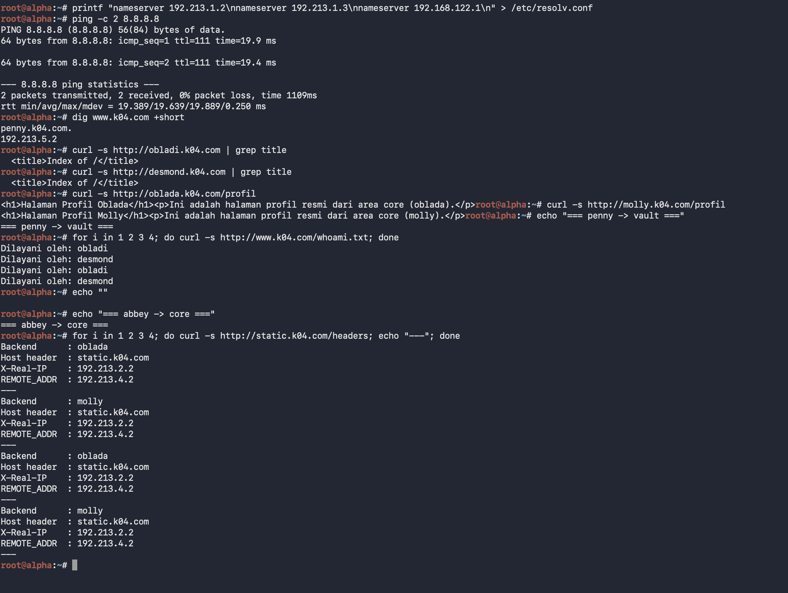

Untuk memastikan `penny` juga meneruskan header ke area vault, dilakukan pengecekan log pada node `obladi`:
```bash
tail -n 2 /var/log/apache2/header.log
```

**Hasil yang diharapkan:** Log mencatat `dari=192.213.5.2 Host=www.k04.com X-Real-IP=192.213.2.2`. Hal ini mengonfirmasi bahwa:
- Permintaan yang diterima `obladi` berasal dari `penny` (`192.213.5.2`).
- Header `Host` asli (`www.k04.com`) dan IP asli pengunjung (`192.213.2.2`) berhasil diteruskan oleh `penny` ke area vault.

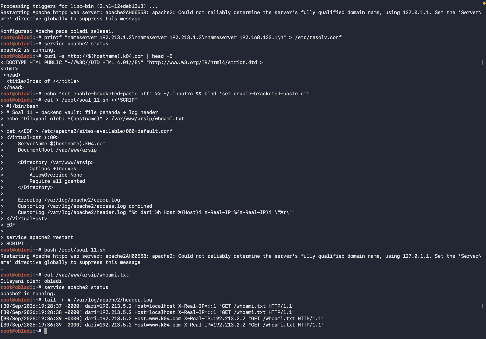


12. Di dalam gerbang `penny` terdapat ruang khusus yang menyimpan dokumen rahasia sindikat. Agar tidak sembarang pengunjung dapat masuk, path `/admin` pada `penny` dilindungi menggunakan **Basic Authentication**. Setiap pengunjung yang mengakses `/admin` wajib memasukkan username `prabs` dan password `pakar_pinter_jadi_gob***`. Pengunjung tanpa kredensial atau dengan kredensial yang salah akan ditolak.

**Konfigurasi di Penny**

Langkah pertama adalah menginstal paket `apache2-utils` yang berisi perintah `htpasswd`, lalu membuat file password untuk user `prabs`. Password disimpan dalam bentuk terenkripsi (hash), bukan teks biasa:
```bash
apt install apache2-utils -y
htpasswd -cb /etc/apache2/.htpasswd prabs 'pakar_pinter_jadi_gob***'
```
Keterangan: opsi `-c` untuk membuat file baru, dan `-b` agar password dapat dituliskan langsung pada perintah. Password ditulis di dalam tanda kutip satu karena mengandung karakter `*`.

Selanjutnya dibuat halaman isi dari ruang rahasia tersebut:
```bash
mkdir -p /var/www/admin
echo "<h1>Dokumen Rahasia Sindikat - Penny</h1>" > /var/www/admin/index.html
```

Kemudian ditambahkan konfigurasi `/admin` ke folder `penny-extra` yang sudah disiapkan pada soal 11 (folder ini otomatis dimuat oleh virtual host `www.k04.com`):
```bash
cat <<'EOF' > /etc/apache2/penny-extra/admin.conf
ProxyPass /admin !
Alias /admin /var/www/admin

<Directory /var/www/admin>
    AuthType Basic
    AuthName "Ruang Rahasia Penny"
    AuthUserFile /etc/apache2/.htpasswd
    Require valid-user
</Directory>
EOF

apache2ctl configtest && service apache2 restart
```

Penjelasan konfigurasi:
- `ProxyPass /admin !`: tanda `!` berarti path `/admin` **dikecualikan** dari reverse proxy, sehingga tidak diteruskan ke area vault dan dilayani langsung oleh `penny`.
- `Alias /admin /var/www/admin`: path `/admin` diarahkan ke folder `/var/www/admin` milik `penny`.
- `AuthType Basic` dan `AuthUserFile`: mengaktifkan Basic Authentication menggunakan file password yang telah dibuat.
- `Require valid-user`: hanya user yang terdaftar dengan password yang benar yang diizinkan masuk.

**Validasi**

Untuk membuktikan bahwa perlindungan `/admin` berjalan dengan benar, dilakukan pengujian dari node klien `alpha` dengan tiga skenario: tanpa login, dengan password salah, dan dengan kredensial yang benar.

**Cara Validasi:**
```bash
echo "=== Tanpa login ==="
curl -s -o /dev/null -w "HTTP %{http_code}\n" http://www.k04.com/admin/
echo "=== Password salah ==="
curl -s -o /dev/null -w "HTTP %{http_code}\n" -u 'prabs:salah' http://www.k04.com/admin/
echo "=== Login benar ==="
curl -s -w "\nHTTP %{http_code}\n" -u 'prabs:pakar_pinter_jadi_gob***' http://www.k04.com/admin/
```

**Hasil yang diharapkan:** Akses tanpa login dan dengan password salah mendapatkan kode `HTTP 401` (Unauthorized), sedangkan akses dengan kredensial yang benar mendapatkan kode `HTTP 200` (OK) beserta isi halaman rahasia. Hal ini mengonfirmasi bahwa:
- Path `/admin` berhasil dilindungi dan menolak pengunjung tanpa kredensial yang valid.
- Hanya user `prabs` dengan password yang benar yang dapat mengakses dokumen rahasia di `penny`.
- Path `/admin` dilayani langsung oleh `penny` dan tidak diteruskan ke area vault.

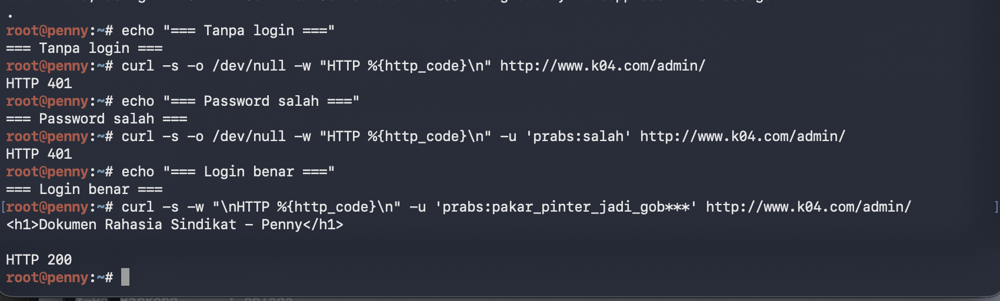


13. Setiap entitas dari luar harus memanggil gerbang The Mesh menggunakan nama kanoniknya, yaitu nama resmi yang menjadi identitas publik layanan. Oleh karena itu, akses yang menggunakan IP atau nama node gerbang secara langsung akan dialihkan (redirect) ke nama kanonik. Akses ke IP `penny` (`192.213.5.2`) maupun `penny.k04.com` dialihkan secara **permanen (301)** ke `www.k04.com`, sedangkan akses ke IP `abbey` (`192.213.4.2`) maupun `abbey.k04.com` dialihkan secara **sementara (302)** ke `static.k04.com`.

Perbedaan kedua jenis redirect:
- **301 Moved Permanently**: memberi tahu pengunjung (dan browser) bahwa alamat tersebut sudah pindah secara permanen, sehingga browser akan langsung menuju alamat baru pada akses berikutnya.
- **302 Found / Moved Temporarily**: memberi tahu bahwa pengalihan hanya bersifat sementara, sehingga alamat lama tetap dianggap berlaku.

Web server dapat membedakan tujuan akses dengan melihat header `Host`, yaitu nama yang diketik oleh pengunjung. Jika `Host` berisi nama kanonik (`www.k04.com` atau `static.k04.com`), permintaan dilayani seperti biasa. Jika berisi IP atau nama node, permintaan dialihkan.

**Konfigurasi di Penny (Redirect 301)**

Pada `penny` dibuat virtual host baru khusus untuk pengalihan. Nama file diawali `000-` agar dimuat paling awal oleh Apache, sehingga virtual host ini menjadi *default* yang juga menangkap akses melalui alamat IP:
```bash
cat <<'EOF' > /etc/apache2/sites-available/000-canonical.conf
<VirtualHost *:80>
    ServerName penny.k04.com
    ServerAlias 192.213.5.2 k04.com

    Redirect permanent / http://www.k04.com/
</VirtualHost>
EOF

a2ensite 000-canonical
apache2ctl configtest && service apache2 restart
```
Keterangan: `ServerAlias` berisi IP `penny` serta domain apex `k04.com`, sehingga semua akses selain `www.k04.com` diarahkan ke nama kanonik. `Redirect permanent` menghasilkan kode status 301.

**Konfigurasi di Abbey (Redirect 302)**

Pada `abbey` dibuat server block Nginx baru yang menangkap akses ke `abbey.k04.com` dan IP `192.213.4.2`, lalu mengembalikan kode 302 menuju `static.k04.com`:
```bash
cat <<'EOF' > /etc/nginx/sites-available/canonical
server {
    listen 80;
    server_name abbey.k04.com 192.213.4.2;

    return 302 http://static.k04.com$request_uri;
}
EOF

ln -sf /etc/nginx/sites-available/canonical /etc/nginx/sites-enabled/canonical
nginx -t && service nginx restart
```
Keterangan: variabel `$request_uri` mempertahankan path yang diakses. Contohnya, akses ke `abbey.k04.com/orion` akan dialihkan ke `static.k04.com/orion`.

**Validasi**

Untuk membuktikan bahwa pengalihan berjalan sesuai ketentuan, dilakukan pengujian dari node klien `alpha` menggunakan `curl -I` untuk melihat kode status dan tujuan pengalihan (header `Location`). Selain itu, dipastikan pula bahwa nama kanonik `www.k04.com` dan `static.k04.com` tetap dapat diakses secara normal.

**Cara Validasi:**
```bash
for url in http://192.213.5.2/ http://penny.k04.com/ http://192.213.4.2/ http://abbey.k04.com/; do
  echo "=== $url ==="
  curl -s -I "$url" | grep -iE "^HTTP|^Location"
done
echo "=== Cek www & static tetap normal ==="
curl -s -o /dev/null -w "www    -> HTTP %{http_code}\n" http://www.k04.com/whoami.txt
curl -s -o /dev/null -w "static -> HTTP %{http_code}\n" http://static.k04.com/headers
```

**Hasil yang diharapkan:** Akses ke IP dan domain `penny` menghasilkan `HTTP/1.1 301 Moved Permanently` dengan `Location: http://www.k04.com/`, sedangkan akses ke IP dan domain `abbey` menghasilkan `HTTP/1.1 302 Moved Temporarily` dengan `Location: http://static.k04.com/`. Hal ini mengonfirmasi bahwa:
- `penny` berhasil mengalihkan akses non-kanonik secara permanen (301) ke `www.k04.com`.
- `abbey` berhasil mengalihkan akses non-kanonik secara sementara (302) ke `static.k04.com`.
- Akses melalui nama kanonik `www.k04.com` dan `static.k04.com` tetap berjalan normal (`HTTP 200`) dan tidak ikut dialihkan.

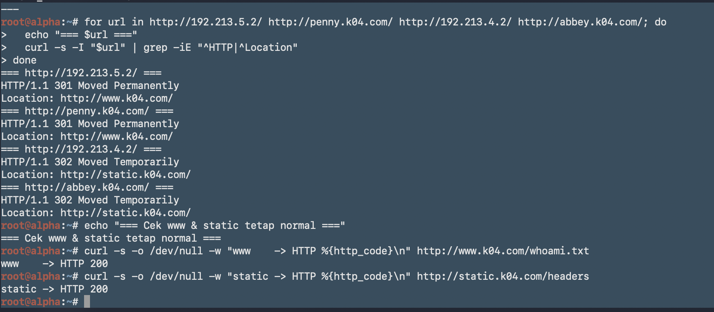


14. Di dalam The Mesh, rekam jejak tidak boleh dipalsukan oleh sistem. Sebelum konfigurasi ini diterapkan, `access.log` pada setiap server backend hanya mencatat alamat IP milik gerbang (`penny` atau `abbey`), karena dari sudut pandang backend, gerbang itulah yang mengirimkan permintaan. Akibatnya, IP asli pengunjung tidak tercatat. Pada tahap ini, setiap server backend di area vault dan area core dikonfigurasi agar membaca header `X-Real-IP` yang dikirimkan oleh gerbang (sudah diatur pada soal 11), sehingga `access.log` mencatat alamat IP asli pengunjung.

Untuk mencegah pemalsuan, backend hanya mempercayai header `X-Real-IP` apabila permintaan berasal dari gerbang resmi, yaitu `penny` (`192.213.5.2`) untuk area vault dan `abbey` (`192.213.4.2`) untuk area core.

**Konfigurasi di Obladi dan Desmond (Area Vault - Apache)**

Pada Apache digunakan modul `remoteip` yang bertugas mengganti IP pengirim dengan IP yang tertulis pada header `X-Real-IP`. Selain itu, format log `combined` diubah dari `%h` (IP yang terhubung langsung) menjadi `%a` (IP asli hasil pembacaan `remoteip`):
```bash
a2enmod remoteip

cat <<'EOF' > /etc/apache2/conf-available/realip.conf
RemoteIPHeader X-Real-IP
RemoteIPInternalProxy 192.213.5.2
LogFormat "%a %l %u %t \"%r\" %>s %O \"%{Referer}i\" \"%{User-Agent}i\"" combined
EOF

a2enconf realip
apache2ctl configtest && service apache2 restart
```

Penjelasan konfigurasi:
- `RemoteIPHeader X-Real-IP`: menentukan header yang berisi IP asli pengunjung.
- `RemoteIPInternalProxy 192.213.5.2`: hanya mempercayai header tersebut apabila permintaan datang dari `penny`.
- `LogFormat ... combined`: format log diperbarui menggunakan `%a` agar yang tercatat adalah IP asli pengunjung.

**Konfigurasi di Oblada dan Molly (Area Core - Nginx)**

Pada Nginx digunakan fitur `real_ip`. Konfigurasi diletakkan di folder `/etc/nginx/conf.d/` yang otomatis dibaca oleh Nginx. Format log bawaan Nginx sudah menggunakan variabel `$remote_addr`, dan nilai variabel ini otomatis berubah menjadi IP asli setelah `real_ip` aktif, sehingga format log tidak perlu diubah:
```bash
cat <<'EOF' > /etc/nginx/conf.d/realip.conf
set_real_ip_from 192.213.4.2;
real_ip_header   X-Real-IP;
EOF

nginx -t && service nginx restart
```

Penjelasan konfigurasi:
- `set_real_ip_from 192.213.4.2`: hanya mempercayai header dari `abbey`.
- `real_ip_header X-Real-IP`: mengambil IP asli pengunjung dari header `X-Real-IP`.

**Validasi**

Untuk membuktikan bahwa `access.log` pada backend mencatat IP asli pengunjung, dikirimkan beberapa permintaan dari node klien `alpha` (`192.213.2.2`) melalui kedua gerbang, kemudian log pada backend diperiksa.

**Cara Validasi:** Mengirimkan permintaan dari `alpha`:
```bash
for i in 1 2 3 4; do
  curl -s -o /dev/null http://www.k04.com/whoami.txt
  curl -s -o /dev/null http://static.k04.com/headers
done
```

Kemudian memeriksa log di `obladi` (area vault):
```bash
tail -n 6 /var/log/apache2/access.log
```

**Hasil yang diharapkan:** Baris log lama (sebelum konfigurasi) mencatat IP `penny` (`192.213.5.2`), sedangkan baris log baru (setelah konfigurasi) mencatat IP asli `alpha` (`192.213.2.2`).

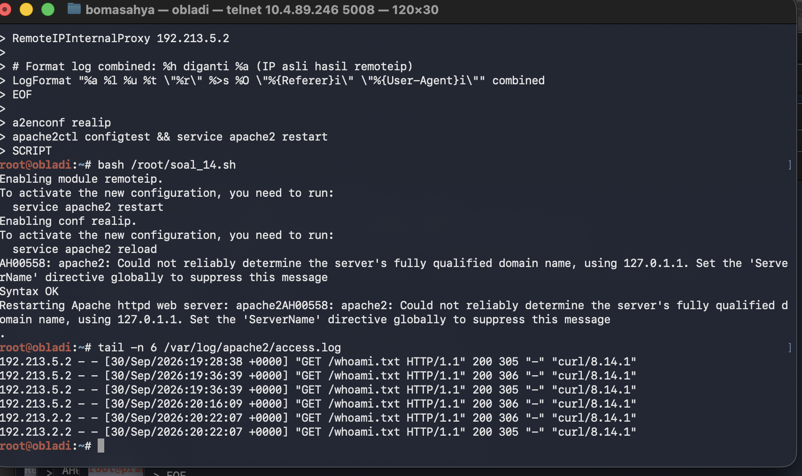

Lalu memeriksa log di `oblada` (area core):
```bash
tail -n 6 /var/log/nginx/access.log
```

**Hasil yang diharapkan:** Baris log lama mencatat IP `abbey` (`192.213.4.2`), sedangkan baris log baru mencatat IP asli `alpha` (`192.213.2.2`). Hal ini mengonfirmasi bahwa:
- Server backend di area vault dan area core berhasil membaca header `X-Real-IP` yang diteruskan oleh gerbang.
- `access.log` mencatat alamat IP asli pengunjung, bukan IP milik `penny` ataupun `abbey`.
- Perbedaan baris log sebelum dan sesudah konfigurasi menjadi bukti langsung keberhasilan perubahan ini.

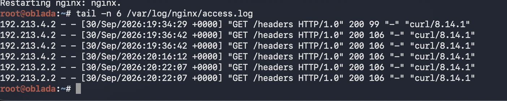

15. `rootkit` menginstruksikan pembuatan jalur proxy khusus yang berdiri sendiri pada kedua gerbang. Jalur ini tidak diteruskan ke area vault maupun area core, melainkan dilayani langsung oleh gerbang itu sendiri. Pada `penny` dibuat jalur `/eternal` yang menyajikan folder `/var/www/eternal` dan mampu menjalankan (merender) file PHP. Sementara itu, pada `abbey` dibuat jalur `/orion` yang menyajikan folder `/var/www/orion` secara murni statis tanpa pemrosesan PHP.

**Konfigurasi di Penny (Jalur `/eternal` dengan PHP)**

Apache tidak dapat menjalankan PHP secara langsung. Oleh karena itu, pada `penny` diinstal **PHP-FPM** (mesin penjalan PHP), lalu Apache dihubungkan ke PHP-FPM menggunakan modul `proxy_fcgi`. Dengan modul ini, setiap permintaan file `.php` diteruskan oleh Apache ke PHP-FPM untuk dijalankan, dan hasilnya dikembalikan ke pengunjung dalam bentuk HTML. Mekanisme ini juga merupakan bentuk reverse proxy, yaitu Apache sebagai perantara menuju PHP-FPM.
```bash
apt install php-fpm -y

PHPFPM=$(ls /etc/init.d | grep -E '^php[0-9.]+-fpm$' | sort -V | tail -n 1)
a2enmod proxy_fcgi setenvif
a2enconf $PHPFPM
```
Keterangan: variabel `PHPFPM` digunakan untuk mendeteksi nama service PHP-FPM yang terpasang secara otomatis (pada praktikum ini `php8.4-fpm`).

Selanjutnya dibuat halaman `index.php` sederhana yang menampilkan nama host, versi PHP, dan waktu server. Informasi ini hanya dapat muncul apabila kode PHP benar-benar dijalankan:
```bash
mkdir -p /var/www/eternal
cat <<'EOF' > /var/www/eternal/index.php
<?php
echo "<h1>Eternal - dirender oleh PHP di " . gethostname() . "</h1>";
echo "<p>Versi PHP: " . phpversion() . "</p>";
echo "<p>Waktu server: " . date('Y-m-d H:i:s') . "</p>";
EOF
```

Kemudian jalur `/eternal` didaftarkan ke folder `penny-extra` (dimuat otomatis oleh virtual host `www.k04.com` sejak soal 11):
```bash
cat <<'EOF' > /etc/apache2/penny-extra/eternal.conf
ProxyPass /eternal !
Alias /eternal /var/www/eternal

<Directory /var/www/eternal>
    DirectoryIndex index.php
    Require all granted
</Directory>
EOF

service $PHPFPM restart
apache2ctl configtest && service apache2 restart
```

Penjelasan konfigurasi:
- `ProxyPass /eternal !`: jalur `/eternal` dikecualikan dari reverse proxy ke area vault, sehingga dilayani langsung oleh `penny`.
- `Alias /eternal /var/www/eternal`: jalur `/eternal` diarahkan ke folder `/var/www/eternal`.
- `DirectoryIndex index.php`: file `index.php` menjadi halaman utama ketika folder diakses.

**Konfigurasi di Abbey (Jalur `/orion` Statis)**

Pada `abbey` dibuat folder `/var/www/orion` berisi halaman HTML biasa:
```bash
mkdir -p /var/www/orion
cat <<'EOF' > /var/www/orion/index.html
<h1>Orion - halaman statis dari abbey</h1>
<p>Tidak ada PHP di sini.</p>
EOF
```

Kemudian ditambahkan blok `location /orion` ke folder `abbey-extra` (dimuat otomatis oleh server `static.k04.com` sejak soal 11). Tidak ada pengaturan PHP pada blok ini, sehingga jalur `/orion` bersifat murni statis:
```bash
cat <<'EOF' > /etc/nginx/abbey-extra/orion.conf
location /orion {
    alias /var/www/orion;
    index index.html;
}
EOF

nginx -t && service nginx restart
```

Penjelasan konfigurasi:
- `location /orion`: menangani seluruh akses ke jalur `/orion`. Karena lebih spesifik daripada `location /`, jalur ini tidak ikut diteruskan ke area core.
- `alias /var/www/orion`: jalur `/orion` diarahkan ke folder `/var/www/orion`.
- `index index.html`: file `index.html` menjadi halaman utama ketika folder diakses.

**Validasi**

Untuk membuktikan bahwa kedua jalur berfungsi sesuai ketentuan, dilakukan pengujian dari node klien `alpha` melalui nama kanonik masing-masing gerbang.

**Cara Validasi:**
```bash
echo "=== www.k04.com/eternal/ (penny, PHP dirender) ==="
curl -s http://www.k04.com/eternal/
echo ""
echo "=== static.k04.com/orion/ (abbey, statis) ==="
curl -s http://static.k04.com/orion/
```

**Hasil yang diharapkan:** Jalur `/eternal/` menampilkan HTML hasil eksekusi PHP berisi nama host `penny`, versi PHP, dan waktu server, bukan teks kode `<?php ... ?>`. Jalur `/orion/` menampilkan halaman HTML statis dari `abbey`. Hal ini mengonfirmasi bahwa:
- `penny` berhasil menyajikan folder `/var/www/eternal` dan merender file PHP melalui PHP-FPM.
- `abbey` berhasil menyajikan folder `/var/www/orion` secara murni statis tanpa pemrosesan PHP.
- Kedua jalur dilayani langsung oleh gerbang masing-masing dan tidak diteruskan ke area vault maupun core.

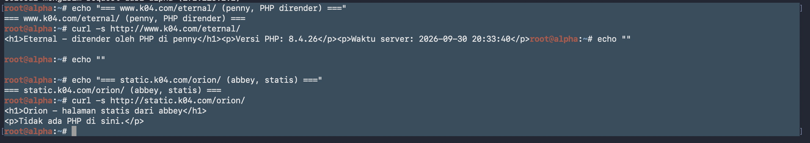


16. Ketahanan gerbang The Mesh harus diuji untuk menghadapi bombardir permintaan. Pada tahap ini, node klien `alpha` melakukan *stress test* (uji beban) menggunakan **ApacheBench (`ab`)** terhadap kedua gerbang, yaitu `www.k04.com` (`penny`) dan `static.k04.com` (`abbey`). Setiap gerbang dikirimi **250 permintaan** dengan **tingkat konkurensi 10**, artinya 10 permintaan dikirim secara bersamaan dalam setiap waktu.

**Konfigurasi di Alpha**

Langkah pertama adalah menginstal paket `apache2-utils` yang berisi program `ab`:
```bash
apt update
apt install apache2-utils -y
```

Selanjutnya dijalankan benchmark terhadap kedua gerbang. Hasil lengkap disimpan ke file agar dapat ditinjau ulang:
```bash
for target in www.k04.com static.k04.com; do
    ab -n 250 -c 10 "http://$target/" > /root/ab_$target.txt 2>&1
done
```
Keterangan parameter:
- `-n 250`: jumlah total permintaan yang dikirim.
- `-c 10`: jumlah permintaan yang dikirim secara bersamaan (konkurensi).

**Validasi**

Untuk menampilkan rangkuman hasil benchmark, diambil baris-baris penting dari file hasil menggunakan `grep`.

**Cara Validasi:**
```bash
grep -E "Server Software|Server Hostname|Concurrency Level|Complete requests|Failed requests|Exceptions|Non-2xx|Requests per second|Time per request|Transfer rate" /root/ab_www.k04.com.txt
grep -E "Server Software|Server Hostname|Concurrency Level|Complete requests|Failed requests|Exceptions|Non-2xx|Requests per second|Time per request|Transfer rate" /root/ab_static.k04.com.txt
```

**Rangkuman hasil benchmark:**

| Parameter | `www.k04.com` (penny → vault) | `static.k04.com` (abbey → core) |
| :--- | :---: | :---: |
| Server Software | Apache/2.4.68 | nginx |
| Concurrency Level | 10 | 10 |
| Complete requests | 250 | 250 |
| Failed requests | 0 | 125 (Length) |
| Requests per second | 2394.68 | 2537.02 |
| Time per request (mean) | 4.176 ms | 3.942 ms |
| Time per request (across all concurrent) | 0.418 ms | 0.394 ms |
| Transfer rate | 2282.43 KB/s | 548.78 KB/s |

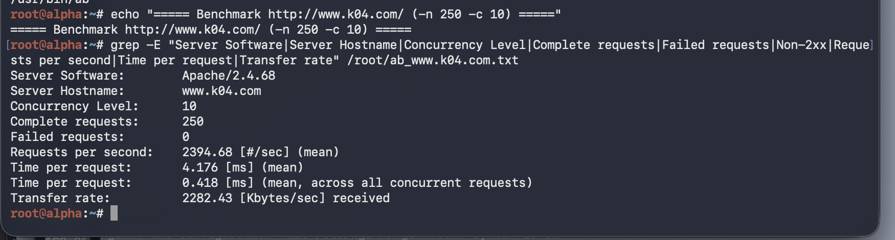

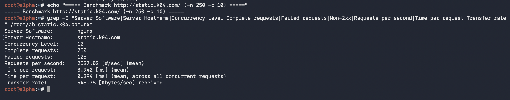

**Hasil yang diharapkan:** Seluruh 250 permintaan pada kedua gerbang berhasil diselesaikan (`Complete requests: 250`) tanpa adanya respons error (tidak terdapat baris `Non-2xx responses`). Hal ini mengonfirmasi bahwa:
- Kedua gerbang (`penny` dan `abbey`) mampu menangani 250 permintaan dengan 10 permintaan bersamaan tanpa kegagalan koneksi.
- Nilai `Failed requests: 125` pada `static.k04.com` **bukan merupakan kegagalan sebenarnya**. Rinciannya menunjukkan `Length: 125`, yaitu ApacheBench menandai respons yang panjang isinya berbeda dari respons pertama. Hal ini terjadi karena `abbey` membagi permintaan secara bergantian ke `oblada` dan `molly`, yang halamannya memiliki panjang teks berbeda. Jumlah 125 (tepat setengah dari 250) justru membuktikan bahwa load balancing berjalan merata 50:50.
- Nilai `Connect`, `Receive`, dan `Exceptions` bernilai 0, menandakan tidak ada koneksi yang benar-benar gagal.

17. Setiap klien di sayap kiri (`alpha`, `beta`, `gamma`) dan sayap kanan (`delta`, `epsilon`) diberikan identitas tambahan berupa **TXT record** pada DNS. TXT record adalah jenis record DNS yang berisi teks bebas (bukan alamat IP) dan biasanya digunakan untuk keterangan atau verifikasi domain. Ketika DNS menerima query TXT untuk domain milik klien (misalnya `alpha.k04.com`), sistem harus mengembalikan teks berupa nama hostname klien tersebut (misalnya `"alpha"`).

**Konfigurasi di Prab (DNS Master)**

TXT record ditambahkan ke file zona `/etc/bind/k04/k04.com` untuk kelima klien. Pengecekan `grep` digunakan agar record tidak tertulis ganda apabila script dijalankan lebih dari sekali:
```bash
ZONE_FILE=/etc/bind/k04/k04.com

for h in alpha beta gamma delta epsilon; do
    grep -qE "^$h[[:space:]]+IN[[:space:]]+TXT" "$ZONE_FILE" || \
        printf '%-12s IN      TXT     "%s"\n' "$h" "$h" >> "$ZONE_FILE"
done
```

Baris yang ditambahkan ke file zona:
```
alpha        IN      TXT     "alpha"
beta         IN      TXT     "beta"
gamma        IN      TXT     "gamma"
delta        IN      TXT     "delta"
epsilon      IN      TXT     "epsilon"
```

Setelah file zona diubah, **nilai serial SOA wajib dinaikkan**. Server slave (`tedd`) hanya akan menyalin ulang zona apabila serial pada master lebih besar dari serial yang dimilikinya:
```bash
OLD=$(grep -m1 -oE '[0-9]{10}' "$ZONE_FILE")
NEW=$((OLD + 1))
sed -i "s/$OLD/$NEW/" "$ZONE_FILE"
echo "Serial SOA: $OLD -> $NEW"

named-checkzone k04.com "$ZONE_FILE" && service bind9 restart
```
Keterangan: `named-checkzone` digunakan untuk memeriksa kebenaran penulisan file zona sebelum BIND9 direstart. Serial naik dari `2026092801` menjadi `2026092802`.

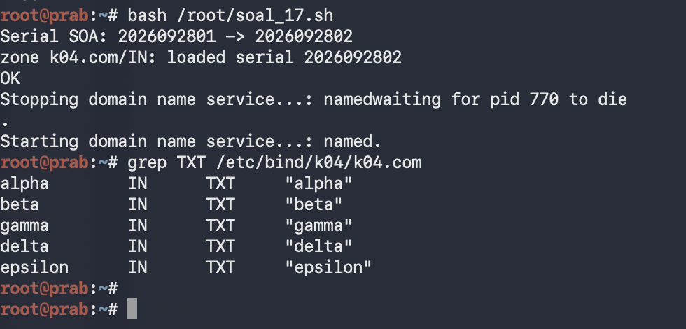

**Validasi**

Untuk membuktikan bahwa TXT record berhasil ditambahkan dan tersinkronisasi ke server slave, dilakukan query TXT dari node klien `alpha` secara langsung ke `prab` (`192.213.1.2`) dan `tedd` (`192.213.1.3`), serta membandingkan serial SOA keduanya.

**Cara Validasi:**
```bash
for h in alpha beta gamma delta epsilon; do
  echo "$h.k04.com -> prab: $(dig @192.213.1.2 $h.k04.com TXT +short) | tedd: $(dig @192.213.1.3 $h.k04.com TXT +short)"
done
echo "Serial prab: $(dig @192.213.1.2 k04.com SOA +short | awk '{print $3}')"
echo "Serial tedd: $(dig @192.213.1.3 k04.com SOA +short | awk '{print $3}')"
```

**Hasil yang diharapkan:** Query TXT untuk setiap klien mengembalikan nama hostname masing-masing (`"alpha"`, `"beta"`, `"gamma"`, `"delta"`, `"epsilon"`) baik dari `prab` maupun `tedd`, dan serial SOA keduanya bernilai sama (`2026092802`). Hal ini mengonfirmasi bahwa:
- TXT record untuk kelima klien berhasil ditambahkan pada zona `k04.com`.
- Setiap query TXT mengembalikan teks berupa nama hostname klien yang bersangkutan.
- Kenaikan serial SOA berhasil memicu zone transfer, sehingga `tedd` memiliki salinan zona terbaru yang identik dengan `prab`.

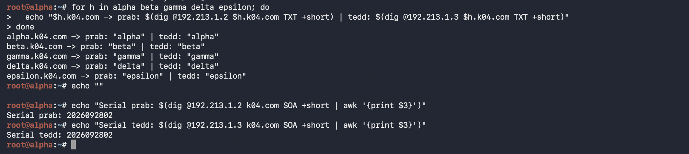

18. Pada tahap ini diuji bagaimana perubahan record DNS menyebar ke klien dengan memperhatikan **TTL (Time To Live)**. TTL adalah lamanya waktu (dalam detik) sebuah jawaban DNS boleh disimpan (*cache*) oleh resolver sebelum resolver wajib bertanya ulang ke server DNS. A record milik `abbey.k04.com` diubah ke alamat IP fiktif `172.30.18.18`, dengan TTL sebesar **15 detik**. Serial SOA pada `prab` dinaikkan agar `tedd` ikut tersinkron. Kemudian diverifikasi tiga fase pencarian:
1. **Sebelum perubahan**: mengembalikan IP lama (`192.213.4.2`).
2. **Sesaat setelah perubahan** (dalam jeda 15 detik): masih mengembalikan IP lama karena jawaban tersimpan di cache.
3. **Setelah TTL habis**: berubah ke IP fiktif yang baru (`172.30.18.18`).

**Mengapa Diperlukan Cache Resolver di Klien**

`prab` dan `tedd` merupakan server DNS *authoritative* (pemilik zona `k04.com`). Server authoritative tidak menyimpan cache untuk zonanya sendiri, sehingga query langsung ke `prab` atau `tedd` akan langsung mendapatkan jawaban terbaru tanpa jeda. Agar efek TTL dan cache dapat diamati, pada `alpha` dipasang **dnsmasq** sebagai *caching resolver* lokal. dnsmasq menyimpan jawaban dari `prab` sesuai nilai TTL-nya, sama seperti resolver pada umumnya.
```
alpha  --query-->  dnsmasq (cache, 127.0.0.1)  --query-->  prab (authoritative)
```

**Tahap 1 - Menetapkan TTL 15 Detik di Prab**

Sebelum IP diubah, TTL record `abbey` terlebih dahulu diatur menjadi 15 detik dengan IP yang masih asli. Hal ini dilakukan agar cache pada klien hanya menyimpan IP lama selama 15 detik (bukan TTL bawaan 604800 detik atau 1 minggu):
```bash
bash /root/soal_18.sh ttl
```
Perintah tersebut mengubah baris `abbey` pada file zona, menaikkan serial SOA, lalu memuat ulang zona:
```
abbey       15      IN      A       192.213.4.2
```

<!-- Hapus baris gambar di bawah jika tidak ada screenshot -->


**Tahap 2 - Memasang dnsmasq di Alpha**

dnsmasq dipasang di `alpha` dan dijalankan sebagai cache DNS pada `127.0.0.1` yang meneruskan query ke `prab`:
```bash
apt install dnsmasq -y
dnsmasq --no-resolv --no-hosts --server=192.213.1.2 \
        --listen-address=127.0.0.1 --bind-interfaces --cache-size=1000
```
Keterangan: `--server=192.213.1.2` berarti dnsmasq bertanya ke `prab`, sedangkan `--listen-address=127.0.0.1` berarti dnsmasq hanya melayani query dari `alpha` sendiri, sehingga tidak mengganggu konfigurasi DNS utama.

Pengecekan awal menunjukkan TTL yang terus berkurang, yang membuktikan jawaban diambil dari cache:
```bash
dig @127.0.0.1 abbey.k04.com +noall +answer   # TTL 15
sleep 5
dig @127.0.0.1 abbey.k04.com +noall +answer   # TTL 10
```

<!-- Hapus baris gambar di bawah jika tidak ada screenshot -->


**Tahap 3 - Mengubah IP dan Memantau Tiga Fase**

Pada `alpha` dijalankan pemantauan setiap 2 detik yang membandingkan jawaban dari cache (`127.0.0.1`) dengan jawaban langsung dari `prab`:
```bash
bash /root/soal_18.sh pantau
```

Saat pemantauan berjalan, pada `prab` dijalankan perubahan IP `abbey` ke IP fiktif, disertai kenaikan serial SOA:
```bash
bash /root/soal_18.sh ubah
```
```
abbey       15      IN      A       172.30.18.18
```

Output pada `prab` menunjukkan serial naik dari `2026092803` menjadi `2026092804`, serta `tedd` telah tersinkron dengan serial dan jawaban yang sama:

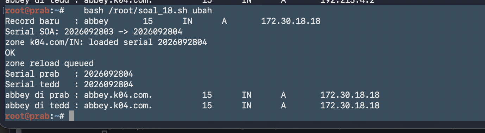

**Validasi**

Hasil pemantauan dari `alpha` memperlihatkan tiga fase dengan jelas:

| Waktu | Jawaban via cache (alpha) | Jawaban langsung ke prab | Fase |
| :---: | :---: | :---: | :--- |
| 21:28:02 – 21:28:20 | `192.213.4.2` | `192.213.4.2` | 1 - Sebelum perubahan |
| 21:28:22 – 21:28:31 | `192.213.4.2` (TTL 11 → 2) | `172.30.18.18` | 2 - Perubahan baru terjadi, cache masih menyimpan IP lama |
| 21:28:33 – seterusnya | `172.30.18.18` | `172.30.18.18` | 3 - TTL habis, cache mengambil IP baru |

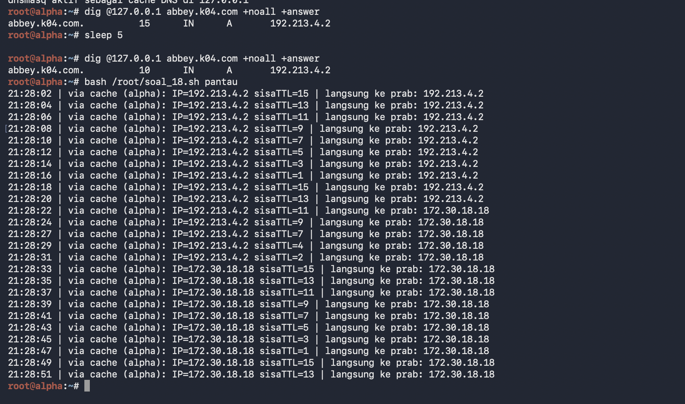

**Hasil yang diharapkan:** Terlihat tiga fase pencarian sesuai ketentuan. Hal ini mengonfirmasi bahwa:
- Sebelum perubahan, seluruh query mengembalikan IP lama `192.213.4.2`.
- Sesaat setelah perubahan, `prab` sudah menjawab IP fiktif `172.30.18.18`, tetapi klien yang bertanya melalui cache masih menerima IP lama hingga sisa TTL habis.
- Setelah TTL 15 detik habis, cache mengambil jawaban baru dari `prab` sehingga klien menerima IP fiktif `172.30.18.18`.
- Serial SOA `prab` dan `tedd` bernilai sama, menandakan zone transfer berjalan setelah perubahan.

**Pemulihan Konfigurasi**

Sesuai ketentuan soal 20, konfigurasi nomor 18 dikembalikan ke kondisi normal. Record `abbey` dikembalikan ke IP asli dengan TTL bawaan, dan dnsmasq pada `alpha` dihentikan:
```bash
# di prab
bash /root/soal_18.sh kembali

# di alpha
pkill dnsmasq
dig abbey.k04.com +short   # 192.213.4.2
```

<!-- Hapus baris gambar di bawah jika tidak ada screenshot -->
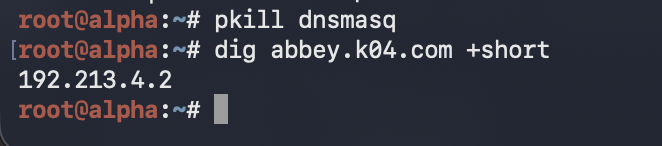

19. Pada tahap ini dibuat sebuah CNAME record yang menghubungkan domain internal `outbound.k04.com` ke domain eksternal di internet, yaitu `http.badssl.com`. **CNAME (Canonical Name)** adalah record DNS yang berfungsi sebagai alias, yang menyatakan bahwa sebuah nama merupakan nama lain dari domain tujuan. Dengan demikian, ketika klien mengakses `outbound.k04.com`, DNS akan mengarahkannya ke alamat IP milik `http.badssl.com`.

Alur resolusi yang terjadi adalah sebagai berikut:
```
alpha -> prab: "outbound.k04.com?"
prab  -> "CNAME http.badssl.com." -> prab bertanya ke forwarder (192.168.122.1) -> IP publik badssl
alpha -> terhubung ke IP publik badssl melalui NAT di rootkit
```

**Konfigurasi di Prab (DNS Master)**

CNAME record ditambahkan ke file zona `k04.com`, kemudian serial SOA dinaikkan dan BIND9 direstart:
```bash
ZONE_FILE=/etc/bind/k04/k04.com

grep -q "^outbound" "$ZONE_FILE" || \
    echo "outbound    IN      CNAME   http.badssl.com." >> "$ZONE_FILE"

OLD=$(grep -m1 -oE '[0-9]{10}' "$ZONE_FILE")
NEW=$((OLD + 1))
sed -i "s/$OLD/$NEW/" "$ZONE_FILE"

named-checkzone k04.com "$ZONE_FILE" && service bind9 restart
```
Keterangan: tanda titik (`.`) di akhir `http.badssl.com.` wajib ditulis. Tanda ini menandakan nama domain absolut. Tanpa titik, BIND9 akan menganggapnya sebagai nama di dalam zona sendiri sehingga menjadi `http.badssl.com.k04.com`.

<!-- Hapus baris gambar di bawah jika tidak ada screenshot -->
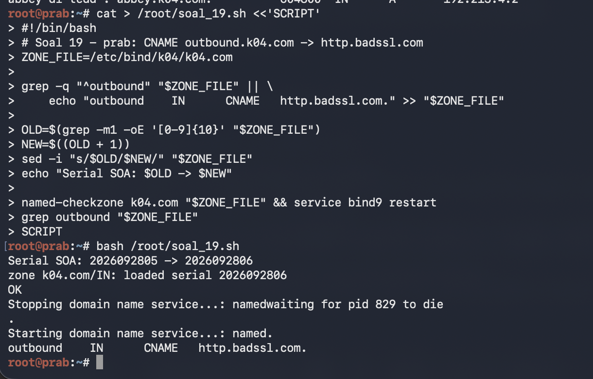

**Validasi**

Pengujian dilakukan dari node klien `alpha`. Pertama, diperiksa hasil resolusi DNS untuk `outbound.k04.com`, kemudian dilakukan perintah `curl` untuk membandingkan isi halaman dengan `http.badssl.com`.

**Cara Validasi:**
```bash
dig outbound.k04.com +noall +answer
curl -s http://outbound.k04.com | head -n 8
curl -sv -H "Host: http.badssl.com" http://outbound.k04.com 2>&1 | grep -E "Connected to|> Host:"
curl -s -H "Host: http.badssl.com" http://outbound.k04.com | head -n 15
if [ "$(curl -s -H 'Host: http.badssl.com' http://outbound.k04.com | md5sum)" = "$(curl -s http://http.badssl.com | md5sum)" ]; then echo "ISI SAMA"; else echo "ISI BERBEDA"; fi
```

**Catatan tentang Header Host**

Server `badssl.com` melayani banyak situs sekaligus dalam satu alamat IP (*virtual hosting*) dan menentukan situs mana yang ditampilkan berdasarkan header `Host` yang dikirim oleh klien, sama seperti mekanisme yang digunakan `penny` dan `abbey` pada soal 13. Saat menjalankan `curl http://outbound.k04.com`, resolusi DNS melalui CNAME sudah berhasil mengarahkan koneksi ke server badssl, tetapi `curl` mengirimkan `Host: outbound.k04.com`. Karena server badssl tidak mengenal nama tersebut, halaman yang dikembalikan bukan halaman `http.badssl.com`. Oleh karena itu, akses tetap dilakukan melalui `outbound.k04.com` (sehingga resolusi DNS tetap menggunakan CNAME), namun header `Host` disesuaikan menjadi `http.badssl.com`.

**Hasil yang diharapkan:** Query DNS menunjukkan `outbound.k04.com` merupakan CNAME dari `http.badssl.com` yang berujung pada alamat IP publik badssl. Output `curl -v` menunjukkan koneksi dibuat ke `outbound.k04.com` dengan header `Host: http.badssl.com`, dan isi halaman yang dikembalikan identik dengan `http.badssl.com` (`ISI SAMA`). Hal ini mengonfirmasi bahwa:
- CNAME record `outbound.k04.com` berhasil mengarahkan resolusi nama ke domain eksternal `http.badssl.com`.
- `prab` berhasil meneruskan query domain eksternal ke forwarder untuk mendapatkan alamat IP publik.
- Klien internal dapat menjangkau server eksternal melalui domain internal berkat resolusi CNAME dan NAT pada `rootkit`.
- Isi halaman yang diakses melalui `outbound.k04.com` sama persis dengan isi halaman `http.badssl.com`.

[langkah 19.2a](assets/langkah_19.2a.png)
[langkah 19.2b](assets/langkah_19.2b.png)


